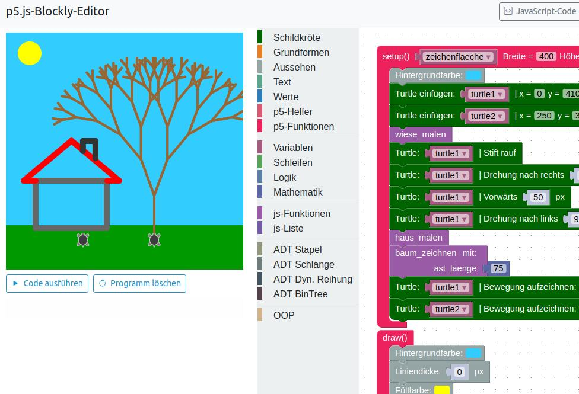
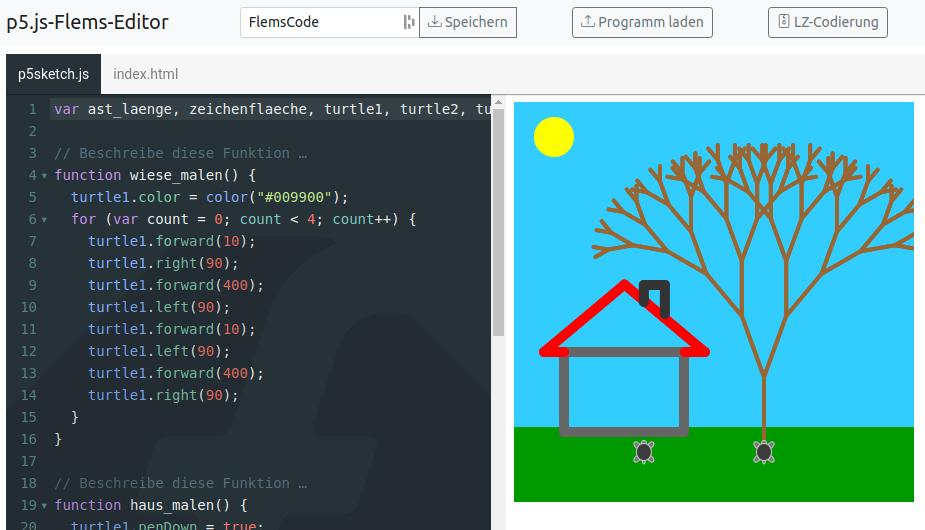
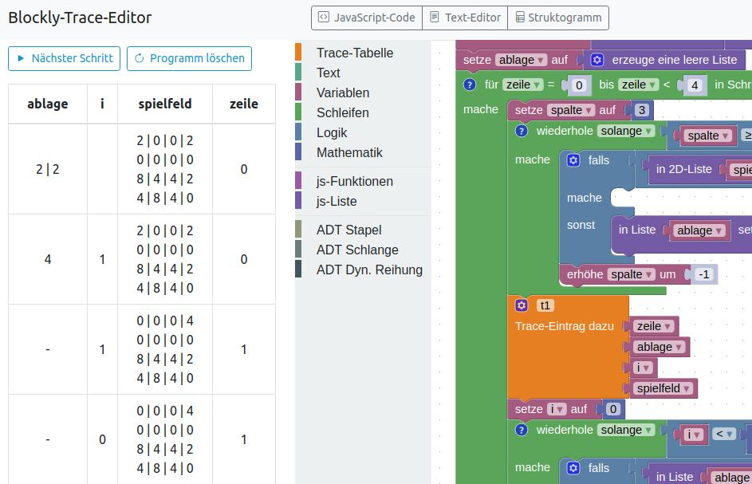

## p5.js-Blockly-Editor

Ein Block-Editor auf der Basis von [Blockly](https://github.com/google/blockly) für die grafische Programmierung mit [p5.js](https://p5js.org/).

---

## p5.js-Flems-Editor

Aus den gebauten Block-Programmen kann automatisch JavaScript-Code generiert und im Text-Modus in der [Flems-Sandbox](https://github.com/porsager/flems) ausgeführt werden.

---

## Blockly-Trace-Editor

Ein Block-Editor zur Erzeugung von Trace-Tabellen und Struktogrammen auf der Basis von [Structogram Viewer](https://github.com/nigjo/structogramview).

---

### Verwendete Bibliotheken: 

- [Blockly](https://github.com/google/blockly) - [Apache License](https://github.com/google/blockly/blob/master/LICENSE)
- [p5.js](https://p5js.org/) - [GNU-LGPL](https://github.com/processing/p5.js/blob/main/license.txt)
- [Flems](https://github.com/porsager/flems) - [DWTFYWTP License](https://github.com/porsager/flems/blob/master/LICENSE)
- [p.turtle](https://github.com/jan-martinek/p.turtle) - [MIT-License](https://github.com/jan-martinek/p.turtle/blob/master/LICENSE)
- [Bootstrap](https://getbootstrap.com/) - [MIT-License](https://github.com/twbs/bootstrap/blob/main/LICENSE)
- [JQuery](https://jquery.com/) - [MIT-License](https://jquery.org/license/)
- [Prism](https://prismjs.com/) - [MIT-License](https://github.com/PrismJS/prism/blob/master/LICENSE)
- [LZ_String](https://github.com/pieroxy/lz-string/) - [MIT-License](https://github.com/pieroxy/lz-string/blob/master/LICENSE)
- [JS-Interpreter](https://github.com/NeilFraser/JS-Interpreter) - [Apache License](https://github.com/NeilFraser/JS-Interpreter/blob/master/LICENSE)
- [Acorn JS-Parser](https://github.com/acornjs/acorn) - [MIT License](https://github.com/acornjs/acorn/blob/master/acorn/LICENSE)
- [Structogram Viewer](https://github.com/nigjo/structogramview) - [Apache License](https://github.com/nigjo/structogramview/blob/main/LICENSE)
- [Dom-to-Image](https://github.com/tsayen/dom-to-image/blob/master/LICENSE) - [MIT License](https://github.com/tsayen/dom-to-image/blob/master/LICENSE)
- [Bootstrap Table](https://bootstrap-table.com/) - [MIT License](https://github.com/wenzhixin/bootstrap-table/blob/master/LICENSE)

---

### Programmierung

Die Editoren werden als statische Client-Applikationen **ohne** die Verwendung eines Application-Frameworks oder Paket-Managers programmiert. Es werden keine Cookies gesetzt und es erfolgt keine Speicherung von Daten auf dem Server.

Die verwendeten Bibliotheken sind statisch in das Projekt eingebaut und werden unregelmäßig manuell aktualisiert. 

Als statische Client-App muss der lokale App-Cache gelöscht werden, damit die Editoren funktionieren. In z.B. Chrome kann man dazu die Taste F12 drücken und mit der rechten Maustaste auf die "Neu-Laden"-Schaltfläche klicken.

---

### Zielgruppe

Die Editoren werden für den Einsatz im [Informatik-Unterricht](https://www.informatik.gym-wst.de) am [Gymnasium Westerstede](https://www.gymnasium-westerstede.de) entwickelt.